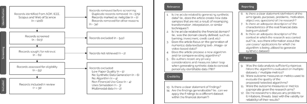

# Literature Review

To develop algorithms for replicating financial transactions, we reviewed the literature on synthetic data generation techniques specific to the financial domain. This review followed the PRISMA methodology (Page et al. 2020), using the following search string:

<em>("Synthetic Data" OR "Artificial Data" OR "Simulated Data" OR "Generated Data" OR "Mock Data" OR "Data Synthesis" OR "Data Augmentation") AND ("Payment*" OR ("Bank*" AND "Transaction") OR ("Financ*" AND "Transaction") OR ("Sequen*" AND "Bank*") OR ("Sequen*" AND "Transaction") OR ("Sequen*" AND "Financ*") OR ("Financ*" AND "Network") OR ("Bank*" AND "Network") OR ("Transaction" AND "Network"))</em>

Using this string, we searched the four prominent scientific databases - Web of Science, Scopus, IEEE Xplore, and ACM Digital Library - for English-language, peer-reviewed papers from the last 10 years (2013-2023), resulting in 1,216 papers to which we applied the PRISM pipeline:

